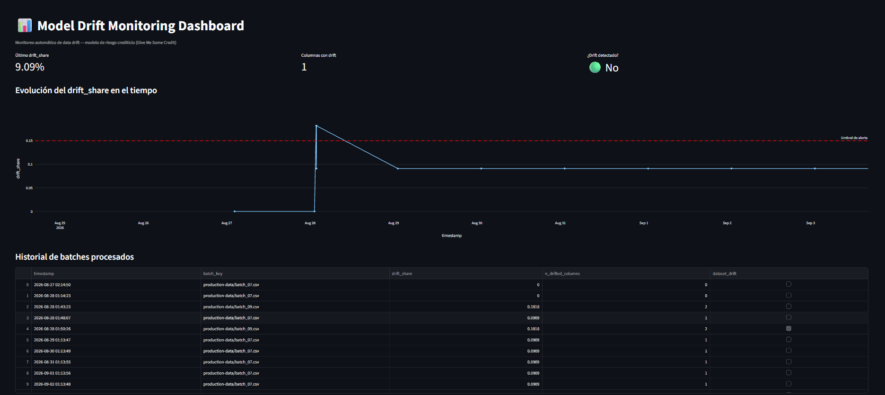

# Model Drift Monitoring Dashboard

Pipeline de monitoreo de drift para un modelo de riesgo crediticio en producción, construido sobre AWS (S3, Lambda, EventBridge, SNS) con un dashboard en Streamlit desplegado vía Docker en EC2.

## Problema que resuelve

Un modelo de machine learning no deja de funcionar de un día para otro — se degrada silenciosamente cuando los datos que recibe en producción dejan de parecerse a los datos con los que fue entrenado. Este proyecto automatiza la detección de ese fenómeno ("data drift") para un modelo de riesgo crediticio, replicando el tipo de proceso de validación continua que se usa en banca para no confiar ciegamente en un modelo que ya no representa la realidad actual del negocio.

## Dataset

**"Give Me Some Credit"** (Kaggle, 2011) — ~150,000 solicitantes de crédito, 11 variables explicativas (ingreso mensual, edad, deuda/ingreso, historial de mora, número de créditos abiertos, etc.) y una variable objetivo binaria (mora grave a 2 años).

Fuente: [kaggle.com/c/GiveMeSomeCredit](https://www.kaggle.com/c/GiveMeSomeCredit)

Para simular producción, el dataset se dividió en un set de referencia (70%, representa el training set) y 10 batches de "producción" (30% restante). A partir del batch 5, se inyecta drift progresivo y creciente en `DebtRatio` (deuda/ingreso) y `MonthlyIncome` (ingreso mensual), simulando un escenario de deterioro macroeconómico.

## Data Drift vs Concept Drift

- **Data drift**: cambia la distribución de las variables de entrada (X) que recibe el modelo. El modelo sigue siendo el mismo, pero está viendo datos distintos a los que vio en entrenamiento.
- **Concept drift**: cambia la relación entre las variables de entrada (X) y el resultado real (Y) — el patrón que el modelo aprendió deja de ser válido, aunque los datos de entrada luzcan similares.

Este proyecto se enfoca en **data drift**, ya que medir concept drift requeriría tener el resultado real (ground truth) de los clientes en producción para comparar contra las predicciones del modelo — algo que queda fuera del alcance de este MVP y se propone como mejora futura.

## Arquitectura

```
S3 (reference-data/ + production-data/)
        │
        ▼
Lambda (Docker + Evidently AI)  ◄── disparada por EventBridge Scheduler (diario)
        │
        ├──► guarda resultados en S3 (metrics/)
        │
        └──► si drift_share ≥ 0.15 ──► SNS ──► email de alerta
        │
        ▼
Streamlit (lee metrics/ de S3) ── Docker ── EC2 (acceso vía URL pública)
```

## Métricas monitoreadas

- **PSI (Population Stability Index)** por variable, calculado con Evidently AI.
- **drift_share**: % de columnas del dataset que muestran drift respecto al umbral de PSI (0.1) por columna.
- **Umbral de alerta**: `drift_share ≥ 0.15` dispara la notificación por SNS.

## Hallazgo técnico: calibración de PSI en variables financieras sesgadas

Al medir drift en `DebtRatio` y `MonthlyIncome` con PSI estándar (sin transformar), el modelo no detectaba cambios reales y significativos en la media de estas variables — a pesar de que `DebtRatio` llegó a triplicarse entre el set de referencia y los batches con drift inyectado.

La causa: ambas variables tienen una distribución muy concentrada en valores bajos con una cola larga de outliers, un patrón típico de variables financieras. Esto hace que el cálculo de PSI por bins de cuantiles pierda sensibilidad ante cambios reales en la mayoría de los datos, porque la cola larga "domina" el cálculo.

**Solución aplicada:** transformar `DebtRatio` y `MonthlyIncome` con `log1p` antes de calcular PSI — una práctica estándar en la industria para variables financieras sesgadas. Esto permitió una separación clara entre:
- Batches sin drift: PSI ≈ 0.006
- Batches con drift real: PSI > 1.9

También se recalibró el umbral de `drift_share` de un valor genérico de 30% a **15%**, ya que en este experimento el drift se concentra deliberadamente en 2 de las 11 columnas del dataset — un patrón realista, donde el drift en producción suele originarse en variables específicas relacionadas al cambio real del contexto de negocio (ingresos, endeudamiento), no distribuirse de forma uniforme en todo el dataset.

## Cómo se dispara una alerta

1. **EventBridge Scheduler** ejecuta la función Lambda una vez al día.
2. La Lambda descarga el `reference.csv` y el batch de producción más reciente desde S3.
3. Calcula PSI por columna con Evidently AI (tras aplicar log-transform a las variables financieras).
4. Guarda el resultado (timestamp, drift_share, columnas afectadas) como JSON en `s3://.../metrics/`.
5. Si `drift_share ≥ 0.15`, publica un mensaje en un topic de **SNS**, que envía un email de alerta a los suscriptores.

## Resultados

El batch 9 (el de mayor drift inyectado) disparó correctamente la alerta:

```json
{
  "batch_key": "production-data/batch_09.csv",
  "dataset_drift": true,
  "drift_share": 0.1818,
  "n_drifted_columns": 2
}
```

El dashboard muestra la evolución del `drift_share` en el tiempo, con una línea de referencia marcando el umbral de alerta:



## Cómo correrlo

**Requisitos:** cuenta de AWS (Free Tier), AWS CLI configurado, Docker Desktop, Python 3.10+.

1. Descargar `cs-training.csv` de Kaggle y colocarlo en `data/`.
2. Generar los datos con drift simulado:
   ```
   python data/generate_data.py
   ```
3. Subir `reference.csv` y los batches a S3:
   ```
   aws s3 cp data/reference.csv s3://TU_BUCKET/reference-data/reference.csv
   aws s3 sync data/production_batches/ s3://TU_BUCKET/production-data/
   ```
4. Construir y subir la imagen de la Lambda a ECR:
   ```
   docker build --provenance=false --sbom=false -t drift-monitoring-lambda ./lambda
   docker tag drift-monitoring-lambda:latest TU_ACCOUNT_ID.dkr.ecr.us-east-1.amazonaws.com/drift-monitoring-lambda:latest
   docker push TU_ACCOUNT_ID.dkr.ecr.us-east-1.amazonaws.com/drift-monitoring-lambda:latest
   ```
5. Crear la función Lambda desde esa imagen, con las variables de entorno `BUCKET_NAME`, `SNS_TOPIC_ARN` y `DRIFT_THRESHOLD=0.15`.
6. Crear un schedule en EventBridge Scheduler para invocar la Lambda diariamente.
7. Crear un topic de SNS y suscribir un email para recibir las alertas.
8. Desplegar el dashboard:
   ```
   docker build -t drift-dashboard ./dashboard
   docker run -d -p 8501:8501 drift-dashboard
   ```

## Mejoras futuras

- Restringir los permisos IAM a nivel de recurso específico (least privilege), en vez de acceso completo a S3/SNS.
- Migrar el dashboard de EC2 a ECS Fargate, para evitar la gestión manual del servidor.
- Rotar automáticamente qué batch procesa la Lambda cada ejecución (actualmente fijo vía el input de EventBridge, pensado para simular la llegada de un batch nuevo por día).
- Monitorear concept drift comparando las predicciones del modelo contra el resultado real (ground truth) de los clientes en producción.
- Agregar DynamoDB para consultas más rápidas sobre el historial de métricas, en vez de leer archivos JSON individuales desde S3.

## Stack

AWS S3 · AWS Lambda (contenedor Docker) · Amazon ECR · Amazon EventBridge Scheduler · Amazon SNS · Amazon EC2 · Evidently AI · Streamlit · Docker · Python (pandas, boto3, plotly)
